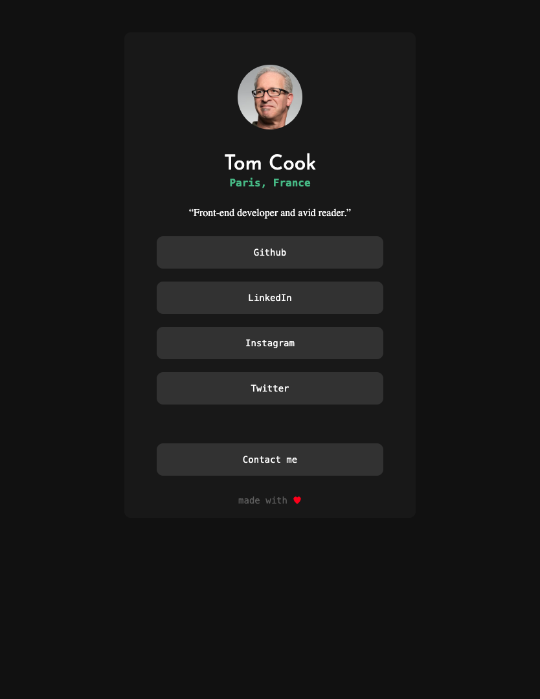

# README - Projet "Social Card"

## Aperçu

Ce projet constitue une introduction pratique à l'intégration HTML et CSS, mettant en scène une carte de profil utilisateur. Elle affiche une image, des informations de base, et des liens vers les réseaux sociaux et un contact email.

## Structure

- **HTML** : Le fichier `index.html` structure le profil avec une image, le nom, la localisation, et une liste de liens.
- **CSS** : Les styles sont définis dans `css/style.css`, contrôlant l'apparence visuelle de la carte.
- **IMG** : Les images / icons sont définis dans `img/`, ou directement utilise via une url.

## Objectif

À travers la création de ce projet, vous serez initiés aux concepts suivants :

- **Structure de page HTML** : Apprendre à organiser le contenu d'une page web en utilisant des éléments HTML de base.
- **Stylisation avec CSS** : Acquérir les compétences pour appliquer des styles visuels aux éléments HTML, y compris la gestion des couleurs, des polices, et des mises en page, pour améliorer l'esthétique et l'expérience utilisateur.
- **Responsive Design** : Comprendre l'importance et les techniques de création de designs qui s'adaptent à différents tailles d'écran, assurant une expérience utilisateur cohérente sur tous les appareils.
- **Liens et Navigation** : Maîtriser la création de liens vers des réseaux sociaux et des emails, soulignant l'importance de la navigation et de l'interaction utilisateur dans le web.

Ce projet est conçu pour vous initier au développement front-end, mais l'apprentissage ne s'arrête pas aux instructions fournies. Il est crucial que vous preniez l'initiative d'explorer par vous-même les concepts qui ne vous sont pas immédiatement clairs, de réaliser des tests pour approfondir votre compréhension, et de vous rappeler que si une question ou un doute survient, Google a très probablement la réponse quelque part. Cette approche proactive est essentielle pour développer une solide base de compétences en développement web.

## Instructions

1. **Explorez le HTML** pour comprendre la structure de la page.
2. **Modifiez le CSS** pour personnaliser le design. Jouez avec les couleurs, la typographie, et le layout.
3. **Rendez la page responsive** en ajustant le CSS pour différents écrans.
4. **Validez le code** en utilisant un outil en ligne pour s'assurer de sa conformité aux standards.

## Bonus

- Expérimentez avec des animations CSS pour les liens.
- Améliorez l'accessibilité, notamment pour les utilisateurs de lecteurs d'écran.
- Ajoutez des fonctionnalités interactives via JavaScript pour une expérience utilisateur enrichie.
